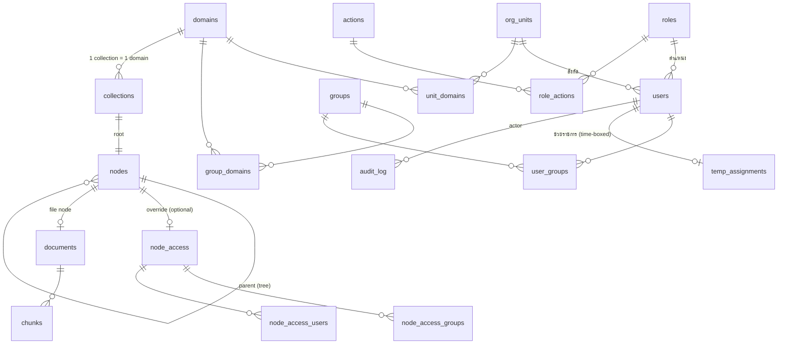

# ปราญช์ — Draft DB Schema (สำหรับ DE ขึ้นโครงสร้าง)

> 📂 [📌 FEATURES](FEATURES.md) · [PERMISSIONS](PERMISSIONS.md) (กฎสิทธิ์ = source of truth) · PoC logic จริง: [`poc/src/lib/access.ts`](poc/src/lib/access.ts) · types: [`poc/src/data/model.ts`](poc/src/data/model.ts)

ขอบเขต: **โครงสร้างสิทธิ์ + collection tree + จุดต่อ RAG pipeline** (ส่วนที่ PoC พิสูจน์แล้ว). DDL เป็น **Postgres**. ส่วน token/credit, persona, agent ฯลฯ อยู่ท้ายไฟล์เป็น pointer.

---

## 0. หลักออกแบบ (อ่านก่อนตัดสินใจ schema)

1. **สิทธิ์เป็น ABAC — คำนวณ ไม่เก็บ.** ห้ามมีตาราง `user_document_permissions`. สิทธิ์ user เกิดจาก join: user → (unit, role, groups) → (domains, clearance, actions) ตอน query/login. โยกย้าย = แก้ FK เดียว.
2. **Deny-by-default.** ทุก path ต้องพิสูจน์สิทธิ์ครบ 3 เงื่อนไข (domain-scope AND clearance AND action).
3. **ชั้นความลับไม่มีทาง bypass** — exception/allow-list แตะแค่แกน scope.
4. **ทุก config ที่ต่างตามองค์กร = ตาราง/setting ไม่ใช่ code** (roles, actions, domains, units, clearance_mode — ดู PERMISSIONS.md §Config surface).
5. **Tree resolve ได้ 2 ทาง**: recursive CTE ตอน query (ถูกต้องเสมอ) หรือ denormalize ลง node/chunk (เร็ว, ต้อง sync ตอนแก้ tree) — ดู §5.

---

## 1. ERD (ภาพรวม)



---

## 2. DDL — โครงสร้างองค์กร + สิทธิ์ (config ได้หมด)

```sql
-- ระดับชั้นความลับ: 0=ทั่วไป 1=ลับ 2=ลับมาก 3=ลับที่สุด (ระเบียบฯ 2544 + ทั่วไป)
-- เก็บเป็น smallint; label อยู่ตาราง config เผื่อองค์กรเปลี่ยน scheme
CREATE TABLE tiers (
  tier        smallint PRIMARY KEY,          -- 0..3
  name        text NOT NULL,                  -- 'ทั่วไป','ลับ',...
  color       text
);

CREATE TABLE domains (
  id          uuid PRIMARY KEY DEFAULT gen_random_uuid(),
  name        text NOT NULL UNIQUE,           -- 'HR','การเงิน',...
  active      boolean NOT NULL DEFAULT true
);

-- หน่วยงาน/กอง (ผังองค์กร — sync จาก HR/AD)
CREATE TABLE org_units (
  id          uuid PRIMARY KEY DEFAULT gen_random_uuid(),
  name        text NOT NULL,
  parent_id   uuid REFERENCES org_units(id),  -- เผื่อผังหลายชั้น (PoC ยังชั้นเดียว)
  external_ref text,                          -- id ในระบบ HR/AD ไว้ sync
  active      boolean NOT NULL DEFAULT true
);

CREATE TABLE unit_domains (
  unit_id     uuid REFERENCES org_units(id) ON DELETE CASCADE,
  domain_id   uuid REFERENCES domains(id)   ON DELETE CASCADE,
  PRIMARY KEY (unit_id, domain_id)
);

-- บทบาท/ระดับตำแหน่ง → clearance + actions
CREATE TABLE roles (
  id          uuid PRIMARY KEY DEFAULT gen_random_uuid(),
  name        text NOT NULL,                  -- 'เจ้าหน้าที่','ผู้จัดการ',...
  rank        int  NOT NULL,                  -- ลำดับ (ไว้เทียบ ≥ Manager)
  clearance   smallint NOT NULL REFERENCES tiers(tier),
  active      boolean NOT NULL DEFAULT true
);

-- action catalog (dynamic — View/Chat/Edit/Connector/ManageCollection/Export/...)
CREATE TABLE actions (
  id          text PRIMARY KEY,               -- 'View','ManageCollection',...
  label       text NOT NULL
);

CREATE TABLE role_actions (
  role_id     uuid REFERENCES roles(id)  ON DELETE CASCADE,
  action_id   text REFERENCES actions(id) ON DELETE CASCADE,
  PRIMARY KEY (role_id, action_id)
);

-- กลุ่มย่อย (cross-cut grant domain)
CREATE TABLE groups (
  id          uuid PRIMARY KEY DEFAULT gen_random_uuid(),
  name        text NOT NULL,
  active      boolean NOT NULL DEFAULT true
);

CREATE TABLE group_domains (
  group_id    uuid REFERENCES groups(id)  ON DELETE CASCADE,
  domain_id   uuid REFERENCES domains(id) ON DELETE CASCADE,
  PRIMARY KEY (group_id, domain_id)
);

CREATE TABLE users (
  id          uuid PRIMARY KEY DEFAULT gen_random_uuid(),
  name        text NOT NULL,
  email       text UNIQUE,
  unit_id     uuid NOT NULL REFERENCES org_units(id),
  role_id     uuid NOT NULL REFERENCES roles(id),
  external_ref text,                          -- LDAP/AD id
  active      boolean NOT NULL DEFAULT true
);

CREATE TABLE user_groups (
  user_id     uuid REFERENCES users(id)  ON DELETE CASCADE,
  group_id    uuid REFERENCES groups(id) ON DELETE CASCADE,
  PRIMARY KEY (user_id, group_id)
);

-- ตำแหน่งชั่วคราว (ช่วยราชการ/รักษาการ) — time-boxed, audit ได้
CREATE TABLE temp_assignments (
  id          uuid PRIMARY KEY DEFAULT gen_random_uuid(),
  user_id     uuid NOT NULL REFERENCES users(id),
  unit_id     uuid NOT NULL REFERENCES org_units(id),
  role_id     uuid NOT NULL REFERENCES roles(id),
  starts_at   timestamptz NOT NULL DEFAULT now(),
  ends_at     timestamptz NOT NULL,           -- บังคับหมดอายุ
  reason      text,
  created_by  uuid REFERENCES users(id)
);
CREATE INDEX ON temp_assignments (user_id, ends_at);

-- นโยบายระดับระบบ (clearance_mode: 'global' | 'unit_only', ฯลฯ)
CREATE TABLE settings (
  key         text PRIMARY KEY,
  value       jsonb NOT NULL
);
```

## 3. DDL — Collection = Tree (folder/file) + exception

```sql
CREATE TABLE collections (
  id          uuid PRIMARY KEY DEFAULT gen_random_uuid(),
  name        text NOT NULL,
  domain_id   uuid NOT NULL REFERENCES domains(id),
  root_node_id uuid,                          -- FK → nodes (set หลัง insert root)
  owner_id    uuid REFERENCES users(id),      -- ผู้สร้าง = owner
  -- policy (แตก column เพื่อ query ได้; เพิ่มใหม่ค่อยลง jsonb)
  chunk_rule       text    NOT NULL DEFAULT '512/128',
  retention_days   int     NOT NULL DEFAULT 3650,
  allow_internet   boolean NOT NULL DEFAULT false,
  secret_local_only boolean NOT NULL DEFAULT true,   -- tier≥1 → Local model เท่านั้น
  created_at  timestamptz NOT NULL DEFAULT now()
);

-- tree: folder + file ใน collection (adjacency list + recursive CTE)
CREATE TABLE nodes (
  id          uuid PRIMARY KEY DEFAULT gen_random_uuid(),
  collection_id uuid NOT NULL REFERENCES collections(id) ON DELETE CASCADE,
  parent_id   uuid REFERENCES nodes(id) ON DELETE CASCADE,  -- NULL = root
  kind        text NOT NULL CHECK (kind IN ('folder','file')),
  name        text NOT NULL,
  -- file: ชั้นของตัวเอง (NOT NULL เมื่อ kind='file')
  -- folder: floor ขั้นต่ำที่ inherit ลงลูก (NULL = ไม่กำหนด)
  tier        smallint REFERENCES tiers(tier),
  position    int NOT NULL DEFAULT 0,
  created_by  uuid REFERENCES users(id),
  created_at  timestamptz NOT NULL DEFAULT now(),
  CONSTRAINT file_has_tier CHECK (kind <> 'file' OR tier IS NOT NULL)
);
CREATE INDEX ON nodes (collection_id, parent_id);

-- access override ที่ node (มี row = override; ไม่มี = inherit จากแม่; root ต้องมีเสมอ)
CREATE TABLE node_access (
  node_id     uuid PRIMARY KEY REFERENCES nodes(id) ON DELETE CASCADE,
  mode        text NOT NULL CHECK (mode IN ('domain','restricted'))
  -- 'domain'     = ตาม domain + exception เพิ่ม (additive)
  -- 'restricted' = เฉพาะ allow-list เท่านั้น (ตัด domain ทิ้ง)
);
CREATE TABLE node_access_groups (
  node_id uuid REFERENCES node_access(node_id) ON DELETE CASCADE,
  group_id uuid REFERENCES groups(id) ON DELETE CASCADE,
  PRIMARY KEY (node_id, group_id)
);
CREATE TABLE node_access_users (
  node_id uuid REFERENCES node_access(node_id) ON DELETE CASCADE,
  user_id uuid REFERENCES users(id) ON DELETE CASCADE,
  PRIMARY KEY (node_id, user_id)
);

-- เอกสารจริง (ผูก file node) + chunk (ผูด Qdrant)
CREATE TABLE documents (
  id          uuid PRIMARY KEY DEFAULT gen_random_uuid(),
  node_id     uuid NOT NULL UNIQUE REFERENCES nodes(id) ON DELETE CASCADE,
  storage_uri text NOT NULL,                  -- Minio object key
  mime        text, size_bytes bigint,
  status      text NOT NULL DEFAULT 'CREATED',-- state machine: CREATED→...→READY (FEATURES §4)
  meta        jsonb NOT NULL DEFAULT '{}'     -- title, owner dept, keywords (TOR 3.2.4)
);

CREATE TABLE chunks (
  id          uuid PRIMARY KEY DEFAULT gen_random_uuid(),
  document_id uuid NOT NULL REFERENCES documents(id) ON DELETE CASCADE,
  idx         int NOT NULL,
  qdrant_point_id uuid NOT NULL,              -- point ใน Qdrant
  UNIQUE (document_id, idx)
);

-- audit (TOR 3.8 — เก็บ ≥1 ปี; AI call log แยกตารางตอนทำ chat)
CREATE TABLE audit_log (
  id          bigserial PRIMARY KEY,
  actor_id    uuid REFERENCES users(id),
  action      text NOT NULL,                  -- 'node.create','access.change','user.update',...
  resource_type text NOT NULL, resource_id text,
  detail      jsonb,
  at          timestamptz NOT NULL DEFAULT now()
);
CREATE INDEX ON audit_log (at);
```

---

## 4. ตรรกะสิทธิ์ (ตรงกับ `poc/src/lib/access.ts` — port เป็น SQL/service)

### 4.1 Effective attributes ของ user (คำนวณตอน query — cache ได้ต่อ session)
```sql
-- unit/role ที่มีผล: temp assignment ที่ active ชนะ (role เอาตัว clearance สูงกว่า)
-- domains = unit_domains(unit ที่มีผล) ∪ group_domains(ทุกกลุ่มของ user)
-- clearance = roles.clearance ของ role ที่มีผล
-- actions = role_actions ของ role ที่มีผล
```

### 4.2 Clearance ต่อ domain (setting `clearance_mode`)
- `global` — clearance เดียวใช้ทุก domain
- `unit_only` — เต็ม clearance เฉพาะ domain ของกองต้นสังกัด; domain จากกลุ่ม → เห็นแค่ tier 0

### 4.3 Resolve tree ต่อ file (recursive CTE)
```sql
WITH RECURSIVE path AS (
  SELECT n.id, n.parent_id, n.tier, n.kind, 0 AS depth
  FROM nodes n WHERE n.id = :file_node_id
  UNION ALL
  SELECT p2.id, p2.parent_id, p2.tier, p2.kind, path.depth+1
  FROM nodes p2 JOIN path ON p2.id = path.parent_id
)
SELECT
  -- ชั้นมีผลจริง = max(tier ของ file, floor ทุก folder บน path)
  (SELECT max(tier) FROM path WHERE tier IS NOT NULL)            AS eff_tier,
  -- access ที่ใช้ = override ที่ "ใกล้ file สุด" (nearest wins; root มีเสมอ)
  (SELECT na.node_id FROM path JOIN node_access na ON na.node_id = path.id
   ORDER BY path.depth ASC LIMIT 1)                              AS access_node_id;
```

### 4.4 กฎตัดสินสุดท้าย (deny-by-default)
```
allow(user, file, action) ⟺
      in_scope(user, access_node)        -- mode='domain': มี domain ∨ อยู่ allow-list
                                         -- mode='restricted': อยู่ allow-list เท่านั้น
  AND clearance_for_domain(user, collection.domain) ≥ eff_tier(file)
  AND action ∈ effective_actions(user)
```

### 4.5 กฎสร้าง collection (PERMISSIONS §3.1)
```
create ⟺ 'ManageCollection' ∈ actions
      AND domain ∈ effective_domains(user)
      AND ทุก tier ที่ตั้ง ≤ clearance_for_domain(user, domain)
```

---

## 5. ⚡ จุดสำคัญสำหรับ DE — enforce ตอน RAG retrieval (TOR 3.2.6, 3.9.3)

เอกสารที่ไม่มีสิทธิ์ **ต้องไม่โผล่ใน vector search เลย** (ห้าม filter หลัง LLM). Recursive CTE ต่อ chunk ตอน search = แพง → **denormalize ลง Qdrant payload**:

```jsonc
// Qdrant point payload (ต่อ chunk)
{
  "collection_id": "...",
  "document_id": "...", "chunk_idx": 3,
  "domain_id": "...",          // จาก collection
  "eff_tier": 1,               // ชั้นมีผลจริง (คำนวณจาก tree แล้ว)
  "access_node_id": "...",     // node_access ที่ govern (nearest override)
  "access_mode": "domain"      // domain | restricted
}
```

**Query-time filter** (ฝั่ง app คำนวณจาก effective attrs ของ user แล้วยิงเป็น Qdrant filter):
```
(access_mode == 'domain'  AND domain_id ∈ user.domains AND eff_tier ≤ user.clearance_for(domain))
OR (access_node_id ∈ user.allowed_access_nodes AND eff_tier ≤ ...)
```
`user.allowed_access_nodes` = node_access ทั้งหมดที่ user ติด allow-list (ตรง user หรือผ่าน group) — query PG ครั้งเดียวต่อ request, cache ได้.

**Invalidation (ราคาของ denormalize):** ย้าย node / แก้ folder floor / แก้ node_access → ต้อง **re-write payload ของทุก chunk ใน subtree** (batch job + trigger `updated_at`). ออกแบบ queue ไว้เลย. ทางเลือก: materialized view `node_effective(node_id, eff_tier, access_node_id)` ใน PG แล้ว sync → Qdrant.

---

## 6. Seed ตัวอย่าง (ตรงกับ PoC — ใช้เทส)

- tiers: 0 ทั่วไป / 1 ลับ / 2 ลับมาก / 3 ลับที่สุด
- roles: เจ้าหน้าที่(clr 0) / ผู้จัดการ(1, +ManageCollection) / ผอ.กอง(2) / ผู้บริหารสูง(3, +Connector)
- units: HR→[ทั่วไป,HR] · การเงิน→[ทั่วไป,การเงิน] · วิศวกรรม→[ทั่วไป,วิศวกรรม] · สำนักผู้ว่าการ→ทั้งหมด
- groups: กลุ่ม HR→[HR] · คกก.มั่นคง→[วิศวกรรม] · คทง.งบ→[การเงิน]
- users: สมชาย(HR,จนท.) · วราภรณ์(HR,ผจก.) · ธนกร(การเงิน,ผอ.) · ปิยะ(วิศวฯ,ผจก.+คกก.มั่นคง) · อนุชา(การเงิน,จนท.+temp HR ผจก. ถึง 30 ก.ย.) · กิตติ(ผู้ว่า)
- collection HR: root(mode=domain) → โฟลเดอร์ค่าตอบแทน(floor=1) → กรอบอัตรากำลัง(tier 0→eff 1) · โฟลเดอร์วินัย(restricted: เฉพาะวราภรณ์)

**Test case ต้องผ่าน** (จาก PoC): ผู้ว่าไม่เห็นโฟลเดอร์วินัย(restricted) · จนท.การเงินไม่เห็น HR ทั้งหมด(domain) · จนท.HR ไม่เห็นเงินเดือน(clearance) · กรอบอัตรากำลังถูกยกเป็นลับ(inherit) · mode unit_only: ปิยะ(คกก.งบ)เห็นการเงินแค่ tier 0

---

## 7. นอกขอบเขตไฟล์นี้ (ตารางที่ต้องตามมา — pointer)

| ส่วน | อ้าง |
|---|---|
| Token/Credit ledger (quota org/dept/user, in/out rate ต่อ model) | PRICING.md + FEATURES §11 (TOR 3.6) |
| Model registry + routing policy (tier→model) | FEATURES §9 (TOR 3.5, 3.9.2) |
| Persona (org/personal) | FEATURES §10 (TOR 3.4) |
| Agent + Data Service (MCP) | FEATURES §12, §9 (TOR 3.7, 3.1) |
| Chat history / AI-call audit (prompt+response ≥1 ปี) | FEATURES §5, §14 (TOR 3.8.1) |
| Personal memory / Skills / Artifacts | FEATURES §21, §22, §20 |

## 8. ข้อที่ DE ต้องรอเคาะ (อย่า hardcode)

1. `clearance_mode` global vs unit_only (per-domain) — ทำเป็น setting แล้ว **แนะ default unit_only**
2. Tier scheme เปลี่ยนได้ไหม (จำนวน/label) — ตาราง `tiers` รองรับแล้ว
3. Cross-domain document (ติดหลาย domain) — ตอนนี้ 1 collection = 1 domain; ถ้าต้อง many-to-many → ตาราง `collection_domains` + most-restrictive
4. ผัง org หลายชั้น (`parent_id`) — สิทธิ์ inherit ตามผังไหม
5. Retention/approval ต่อ tier — คอลัมน์รอเพิ่ม
6. Break-glass — ตาราง `break_glass_grants` (time-boxed + บังคับ audit) ยังไม่ใส่
